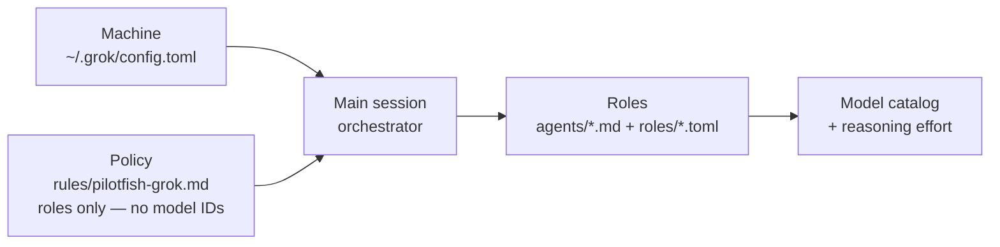
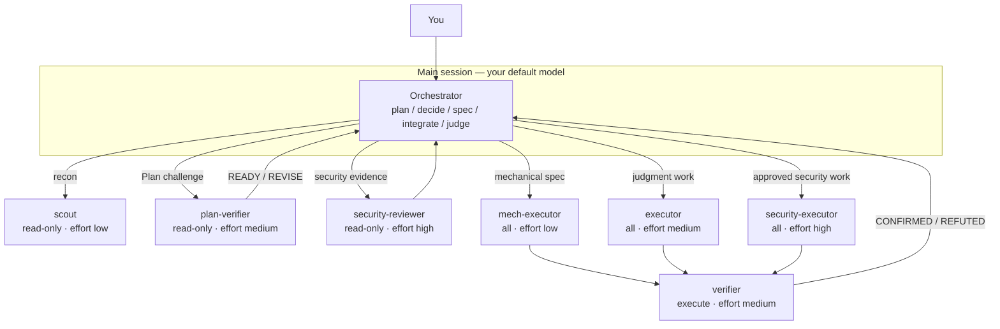
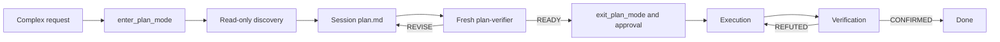

# pilotfish-grok

> Grok Build–native multi-model orchestration in the
> [pilotfish](https://github.com/Nanako0129/pilotfish) family — same idea,
> install surface under `~/.grok/`.

**pilotfish-grok** ports pilotfish orchestration to Grok Build. It keeps the
separation between machine configuration, role bindings, and model-free policy,
and maps lifecycle and capability boundaries onto Grok agents and roles.
Quality comes from explicit approval gates and fresh-context verification—not
from using the strongest model for every step.

Everything installs globally under `~/.grok/`: one setup for every project.

Related lines: [pilotfish](https://github.com/Nanako0129/pilotfish) (Claude
Code) and [pilotfish-codex](https://github.com/miyago9267/pilotfish-codex)
(Codex). Each host has its own release train; this repo does not install
Claude’s `Explore` shadow — `scout` owns discovery.

[繁體中文](./README.zh-TW.md)

## Contents

- [Why](#why)
- [How it works](#how-it-works)
- [Architecture](#architecture)
- [Lifecycle](#lifecycle)
- [Install](#install)
- [Trust & security](#trust--security)
- [What gets installed](#what-gets-installed)
- [Dual harness with Claude pilotfish](#dual-harness-with-claude-pilotfish)
- [Updating](#updating)
- [Model routing](#model-routing)
- [Limitations](#limitations-v10)
- [Uninstall](#uninstall)
- [Versioning](#versioning)
- [Research & design](#research--design)
- [License](#license)

## Why

A coding session spends most tokens on search, mechanical edits, tests, and
docs—not on architecture judgments. Pilotfish routes volume work to leaf roles
and keeps planning, approval, and final judgment in the main session.

On Grok Build today, accounts may only expose a single frontier model. In that
regime pilotfish-grok still helps by:

- Protecting main-session context (recon and bulk work run in child sessions)
- Tiering **reasoning effort** per role (low for recon/mechanical, higher for security)
- Enforcing **capability modes** (`read-only` / `execute` / `all`) on named roles
- Requiring fresh `verifier` passes for non-trivial outcomes

When cheaper models appear in your catalog, pin them in `[subagents.models]`
without rewriting the policy.

## How it works

Three layers, all under `~/.grok/`:

| Layer | File(s) | Job |
|---|---|---|
| **Machine** | `config.toml` | Subagents enabled; optional model pins; main model stays yours |
| **Roles** | `agents/*.md` + `roles/*.toml` | Seven contracts with capability + effort |
| **Policy** | `rules/pilotfish-grok.md` | When to delegate and to which role |



> **Core invariant:** policy names **roles**, never model IDs. Change routing in
> agent/role files or `[subagents.models]`; leave the policy alone.

### The seven Grok roles

| Role | Capability | Effort | When |
|---|---|---|---|
| `scout` | read-only | low | Broad or focused read-only discovery |
| `plan-verifier` | read-only | medium | One envelope or slice; bare `READY` or structured `REVISE` |
| `security-reviewer` | read-only | high | Pre-approval security evidence |
| `mech-executor` | all | low | Mechanical work from a complete spec |
| `executor` | all | medium | Features and fixes needing judgment |
| `verifier` | execute | medium | Outcome challenge; `CONFIRMED` / `REFUTED` |
| `security-executor` | all | high | Approved security-sensitive implementation |

> **Claude-only `Explore` override is not installed.** Pilotfish uses that name
> to shadow Claude Code's built-in agent. Grok needs no such shim; `scout` owns
> discovery. Built-in `explore` remains available if you want it.

`verifier` uses **`execute`** (read + shell, no file edits), not `read-only`, so
it can reproduce tests without writing fixes.

## Architecture

End-to-end flow: you talk to the main session; it spawns named leaf roles and
integrates their results. Subagents cannot spawn further subagents (Grok depth
limit = 1).



### Dispatch principles

- Keep planning, architecture, ambiguity resolution, and final judgment in the main session.
- Spawn named roles with `spawn_subagent`; use `background: true` when independent work can run in parallel.
- Give writing agents exclusive ownership or `isolation: "worktree"`.
- Do not override `model` or `capability_mode` on named roles at spawn time.
- Treat delegated results as evidence. Non-trivial changes get a fresh `verifier` pass.
- Long-running processes stay main-session owned: leaves return exact command + cwd/worktree + env for handoff.

## Lifecycle

Large, ambiguous, architectural, risky, or explicitly plan-first work must
enter native Grok Plan Mode before discovery. Large Plans keep shared
constraints in a program envelope and split only independent execution slices.
The envelope and next executable slice receive fresh read-only reviews before
`exit_plan_mode` presents them for approval. `REVISE` includes blocker,
evidence, minimum revision, and acceptance check. After two automatic revisions
for one unit, Grok pauses it for user direction instead of retrying forever.



| Phase | Gate | Eligible delegation |
|---|---|---|
| **Discovery** | Native Plan Mode active; stable question, scope, evidence format, stop condition | Bounded read-only `scout` on disjoint surfaces |
| **Plan** | Program envelope plus independent slices | Mandatory fresh read-only `plan-verifier` reviews the envelope, then the next executable slice |
| **Approval** | `READY` unlocks `exit_plan_mode`; user approves the verified Plan | Read-only only; no implementation brief yet |
| **Execution** | Stable contract with exclusive ownership and done criteria | `mech-executor` / `executor` / `security-executor` |
| **Verification** | Concrete claim to refute | Fresh `verifier` → `CONFIRMED` / `REFUTED` |

For non-security-sensitive work, a single unknown bug's diagnosis, first fix,
and live check stay in the main session when they share one evidence chain—do
not turn that into a sequential `scout` → `executor` pipeline.

## Install

> Requires Grok Build **0.2.106 or newer**.

From a local clone (recommended):

```sh
git clone --branch v1.0.5 --depth 1 https://github.com/Nanako0129/pilotfish-grok.git
cd pilotfish-grok
grok
```

Paste into the session:

```text
Read the local file install/AGENT-INSTALL.md in the current checkout and follow it to install pilotfish-grok into my global Grok Build configuration.
Show me the full plan of changes and get my approval before writing anything.
```

The agent will preflight your `~/.grok/` state, show a merge plan, and wait for
approval. Install is idempotent—re-running upgrades in place.

Convenience (unpinned `main`):

```text
Read https://raw.githubusercontent.com/Nanako0129/pilotfish-grok/main/install/AGENT-INSTALL.md
and follow it to install pilotfish-grok into my global Grok Build configuration.
Show me the full plan of changes and get my approval before writing anything.
```

Prefer the local clone path so you can review templates before the agent applies them.

## Trust & security

pilotfish-grok is installed by an agent that merges files into `~/.grok/` for
**every future session**. Treat the install prompt like any remote runbook:

- Read [templates/](./templates/) yourself before approving writes.
- Pin to a release tag or commit when you need a frozen surface.
- Keep the approval gate: the agent must not write until you accept the plan.

## What gets installed

| Target | Change |
|---|---|
| `~/.grok/config.toml` | Ensure subagents are enabled; never force main model by default |
| `~/.grok/agents/` | Seven markdown agent definitions |
| `~/.grok/roles/` | Seven TOML role defaults (capability + effort) |
| `~/.grok/rules/pilotfish-grok.md` | Orchestration block between `pilotfish-grok` markers |
| `~/.grok/backups/` | Pristine config + rules backups on install/upgrade |

```text
~/.grok/
├── config.toml              # native subagents + Claude isolation + optional model pins
├── agents/                  # 7× role contracts (markdown)
├── roles/                   # 7× capability + reasoning_effort
├── rules/
│   └── pilotfish-grok.md    # phase policy (markers)
└── backups/                 # installer backups
```

Fresh installs touch only `~/.grok/`. **Claude Code's `~/.claude/` is never
modified.**

## Dual harness with Claude pilotfish

Grok discovers Claude Code settings by default. That compatibility is broader
than `CLAUDE.md`: skills, named agents, MCPs, hooks, session scanners, and
Claude plugins are separate inputs. pilotfish-grok therefore installs a pure
Grok isolation profile in `~/.grok/config.toml`:

```toml
[subagents.toggle]
"Explore" = false   # exact Claude agent name; lowercase built-in explore stays on

[compat.claude]
skills = false
rules = false
agents = false
mcps = false
hooks = false
sessions = false

[plugins]
disabled = ["<every Claude plugin name reported by grok inspect>"]
```

Notes:

- This does not uninstall Claude pilotfish; Claude Code keeps using `~/.claude/`.
- `[compat.claude] agents = false` does not block custom files under
  `~/.claude/agents/` on the tested Grok 0.2.106 build. The installer adds a
  false `[subagents.toggle]` entry for every discovered Claude agent name.
- Claude plugin discovery is independent of the six compatibility cells. The
  installer merges every plugin rooted under `~/.claude/` into
  `[plugins] disabled` while preserving existing entries.
- `grok inspect` can still list disabled discoveries. The E2E acceptance check
  is behavioral: persisted sessions must contain no `/.claude/` context marker
  and no hook execution event.

## Updating

Re-run the install prompt. The installer reads the version stamp in the rules
file (`<!-- pilotfish-grok vX.Y.Z -->`), shows the changelog delta, and applies
changes idempotently—identical files are skipped; customized files require a
diff approval.

## Model routing

| Knob | Where | Default in v1.0 |
|---|---|---|
| Main session model | your `/model` or `[models] default` | **unchanged** by installer |
| Role model | agent `model:` + `[subagents.models].<role>` | `inherit` (parent model) |
| Reasoning effort | `~/.grok/roles/*.toml` | low / medium / high per role table |
| Capability | `default_capability_mode` in role TOML | read-only / execute / all |

When a cheaper model appears in `grok models`, pin recon or mechanical roles:

```toml
[subagents.models]
scout = "your-cheaper-model-id"
mech-executor = "your-cheaper-model-id"
```

Policy text stays the same.

## Verification

```sh
# Static contracts (offline)
python3 -m unittest discover -s tests -v

# Install surface + grok inspect (no model spend)
python3 benchmarks/e2e-dispatch/run.py --skip-live

# Live cue-free routing + spawn/capability proof (needs auth + spend)
python3 benchmarks/e2e-dispatch/run.py
# or: PILOTFISH_GROK_E2E=1 python3 -m unittest tests.test_e2e_dispatch -v
```

See [benchmarks/e2e-dispatch/README.md](./benchmarks/e2e-dispatch/README.md).
The instruction-surface comparison and approval-gate ablations are documented in
[docs/approval-gate-enforcement-research.md](./docs/approval-gate-enforcement-research.md).

## Limitations (v1.0)

- Live e2e uses natural prompts with no agent, role, spawn, delegation, Plan, or
  approval cues and requires their combined sessions to spontaneously dispatch
  all seven roles with the installed capability modes.
- Parent plan mode does **not** block write-capable subagents—read-only roles rely on role capability defaults.
- Single-model catalogs do not get multi-model price arbitrage; effort and context savings still apply.
- Does not uninstall or rewrite Claude pilotfish.
- Pure Grok isolation disables Claude-derived inputs only inside Grok. If you
  intentionally want mixed-harness behavior, restore those config keys from
  the installer backup and do not treat the isolated E2E as representative.
- Live e2e needs credentials and is not free; default CI stays on static tests.

## Uninstall

Ask an agent to follow the Uninstall section of
[install/AGENT-INSTALL.md](./install/AGENT-INSTALL.md), or reverse manually:

1. Delete the seven files under `~/.grok/agents/` and `~/.grok/roles/` that match
   the templates (diff first if customized).
2. Remove the `<!-- pilotfish-grok:begin -->` … `<!-- pilotfish-grok:end -->`
   block from `~/.grok/rules/pilotfish-grok.md` (delete the file if empty).
3. Restore or remove pilotfish-grok-owned keys in `config.toml` using the oldest
   `~/.grok/backups/config.toml.pilotfish-grok-*` when appropriate.

## Versioning

pilotfish-grok uses its own semver. Sibling pilotfish tags are not binding.

| Project | Host | Markers | Roles |
|---|---|---|---|
| [pilotfish](https://github.com/Nanako0129/pilotfish) | Claude Code | `pilotfish` | 8 (incl. Explore) |
| **pilotfish-grok** | Grok Build | `pilotfish-grok` | 7 |
| [pilotfish-codex](https://github.com/miyago9267/pilotfish-codex) | Codex CLI | `pilotfish-codex` | 7 |

## Research & design

- [docs/design.md](./docs/design.md) — Grok-side mapping, capability rationale, deliberately left out
- Claude-side research for the original stack: [pilotfish docs](https://github.com/Nanako0129/pilotfish/tree/main/docs)

## License

MIT. See [LICENSE](./LICENSE).
