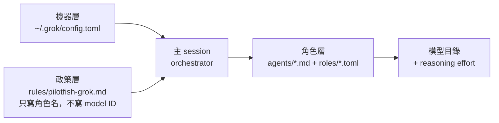
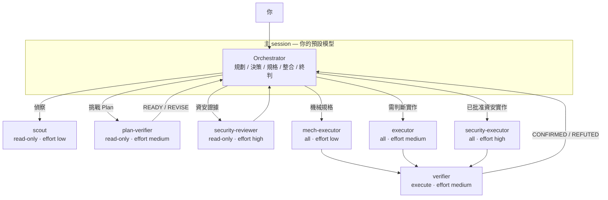

# pilotfish-grok

> [pilotfish](https://github.com/Nanako0129/pilotfish) 家族的 Grok Build 原生編排層——
> 同一套思路，安裝面在 `~/.grok/`。

**pilotfish-grok** 把 pilotfish 的多模型編排移植到 Grok Build。它保留機器設定、角色綁定、無模型名政策的三層分離，並把 lifecycle 與能力邊界翻成 Grok 原生 agents / roles。品質靠明確批准閘與 fresh-context 驗證，而不是每一步都用最強模型。

全部安裝在全域 `~/.grok/`：設定一次，所有專案生效。

同系列還有 [pilotfish](https://github.com/Nanako0129/pilotfish)（Claude Code）與 [pilotfish-codex](https://github.com/miyago9267/pilotfish-codex)（Codex）。各宿主獨立發版；本 repo 不安裝 Claude 的 `Explore` 覆寫，discovery 由 `scout` 負責。

[English](./README.md)

## 目錄

- [為什麼](#為什麼)
- [運作方式](#運作方式)
- [架構](#架構)
- [生命週期](#生命週期)
- [安裝](#安裝)
- [信任與安全](#信任與安全)
- [會寫入什麼](#會寫入什麼)
- [與 Claude pilotfish 雙 harness](#與-claude-pilotfish-雙-harness)
- [更新](#更新)
- [模型路由](#模型路由)
- [限制](#限制-v10)
- [移除](#移除)
- [版本](#版本)
- [研究與設計](#研究與設計)
- [授權](#授權)

## 為什麼

coding session 的 token 多半花在搜尋、機械編輯、測試與文件，不是架構判斷。Pilotfish 把大量工作丟給 leaf 角色，主 session 保留規劃、批准與最終判斷。

在目前的 Grok Build 上，帳號可能只有單一 frontier 模型。此時 pilotfish-grok 仍然有用：

- 保護主 session context（偵察與 bulk 工作在 child session）
- 依角色分層 **reasoning effort**
- 對命名角色強制 **capability mode**（`read-only` / `execute` / `all`）
- 非平凡結果要求 fresh `verifier`

之後若目錄出現較便宜模型，只需在 `[subagents.models]` 釘選，不必改政策文字。

## 運作方式

三層，都在 `~/.grok/`：

| 層 | 檔案 | 職責 |
|---|---|---|
| **機器** | `config.toml` | 啟用 subagents；可選 model pin；主模型仍由你控制 |
| **角色** | `agents/*.md` + `roles/*.toml` | 七個契約 + capability + effort |
| **政策** | `rules/pilotfish-grok.md` | 何時委派、委派給誰 |



> **核心不變式：** 政策只寫 **角色名**，永不嵌入 model ID。換路由改 agent/role 或 `[subagents.models]`，不要改政策散文。

### 七個 Grok 角色

| 角色 | Capability | Effort | 時機 |
|---|---|---|---|
| `scout` | read-only | low | 廣或窄的唯讀 discovery |
| `plan-verifier` | read-only | medium | Plan 就緒；`READY` / `REVISE` |
| `security-reviewer` | read-only | high | 批准前資安證據 |
| `mech-executor` | all | low | 完整規格的機械工作 |
| `executor` | all | medium | 需要判斷的功能與修復 |
| `verifier` | execute | medium | 結果挑戰；`CONFIRMED` / `REFUTED` |
| `security-executor` | all | high | 已批准的資安實作 |

> **不安裝 Claude 專用的 `Explore` 覆寫。** Pilotfish 用該名 shadow Claude Code 內建 agent；Grok 不需要。discovery 由 `scout` 負責。內建 `explore` 仍可用。

`verifier` 使用 **`execute`**（可讀可跑 shell、不可寫檔），而不是 `read-only`，才能重跑測試卻不能動手修。

## 架構

端到端：你與主 session 對話；主 session 以 `spawn_subagent` 派出 leaf 角色並整合結果。子代理不能再 spawn（Grok depth = 1）。



### 委派原則

- 規劃、架構、歧義消解、終判留在主 session
- 命名角色用 `spawn_subagent`；可並行時 `background: true`
- 寫入 agent 要獨佔 ownership 或 `isolation: "worktree"`
- 對命名角色不要在 spawn 時覆寫 `model` / `capability_mode`
- 委派結果是證據，不是結論；非平凡變更走 fresh `verifier`
- 長時間 process 由主 session 擁有；leaf 回傳 exact command + cwd/worktree + env

## 生命週期

大型或模糊工作走階段閘。小而穩定的工作直接在主 session 做，不必儀式。


| 階段 | 閘門 | 可委派 |
|---|---|---|
| **Discovery** | 問題、範圍、證據格式、停止條件穩定 | 有界唯讀 `scout` |
| **Plan** | 一份 Plan：outcome、non-goals、ownership、序列、驗證 | fresh `plan-verifier` → `READY` / `REVISE` |
| **Approval** | 大型／高風險／plan-first 需明確批准 | 僅唯讀；尚不送 implementation brief |
| **Execution** | 穩定 contract、獨佔 ownership、done criteria | `mech-executor` / `executor` / `security-executor` |
| **Verification** | 可被推翻的完成宣稱 | fresh `verifier` → `CONFIRMED` / `REFUTED` |

單一未知 bug 的診斷、第一次修復與現場驗證若共用同一條證據鏈，留在主 session——不要拆成 `scout` → `executor` 管線。

## 安裝

> 需要 Grok Build **0.2.106 或更新**。

建議釘選 release 後再 clone：

```sh
git clone --branch v1.0.2 --depth 1 https://github.com/Nanako0129/pilotfish-grok.git
cd pilotfish-grok
grok
```

貼上：

```text
Read the local file install/AGENT-INSTALL.md in the current checkout and follow it to install pilotfish-grok into my global Grok Build configuration.
Show me the full plan of changes and get my approval before writing anything.
```

Agent 會先 preflight、出示合併計畫，等你批准才寫入。安裝可重跑（冪等升級）。

便利路徑（未釘選、跟著 `main`）：

```text
Read https://raw.githubusercontent.com/Nanako0129/pilotfish-grok/main/install/AGENT-INSTALL.md
and follow it to install pilotfish-grok into my global Grok Build configuration.
Show me the full plan of changes and get my approval before writing anything.
```

建議優先用本地 clone，方便在寫入前先審 templates。

## 信任與安全

安裝會把設定合併進 `~/.grok/`，影響**之後每一個 session**。請把 install prompt 當成任何遠端 runbook：

- 批准前親自讀過 [templates/](./templates/)
- 需要凍結表面時釘選 tag / commit
- 保留 approval gate：未同意計畫前 agent 不應寫入

## 會寫入什麼

| 目標 | 變更 |
|---|---|
| `~/.grok/config.toml` | 確保 subagents 啟用；預設不改主模型 |
| `~/.grok/agents/` | 七個 markdown agent |
| `~/.grok/roles/` | 七個 TOML role（capability + effort） |
| `~/.grok/rules/pilotfish-grok.md` | `pilotfish-grok` 標記區塊內的編排政策 |
| `~/.grok/backups/` | 安裝／升級時的備份 |

```text
~/.grok/
├── config.toml              # [subagents] + 可選 [subagents.models]
├── agents/                  # 7× 角色契約（markdown）
├── roles/                   # 7× capability + reasoning_effort
├── rules/
│   └── pilotfish-grok.md    # 階段政策（markers）
└── backups/                 # installer 備份
```

**不會改 `~/.claude/`。**

## 與 Claude pilotfish 雙 harness

若已安裝 Claude pilotfish，Grok 預設的 Claude 相容層可能一併載入 `~/.claude/CLAUDE.md` / agents。installer 會警告。

安裝後若要以 **Grok 角色表為主**，可設：

```toml
# ~/.grok/config.toml
[compat.claude]
agents = false   # 對 Grok 關掉 Claude 命名指令 agents
```

說明：

- 不會卸載 Claude pilotfish；Claude Code 仍用 `~/.claude/`
- 視 Grok 版本，`~/.claude/agents/*` 仍可能出現在列表；同名角色以 `~/.grok/agents/` 為準
- skills 等其他 compat cell 可獨立調整

## 更新

重跑 install prompt。installer 讀 rules 檔內版本戳（`<!-- pilotfish-grok vX.Y.Z -->`），顯示 changelog 差分，冪等套用——相同檔略過；有自訂則先 diff 再問。

## 模型路由

| 旋鈕 | 位置 | v1.0 預設 |
|---|---|---|
| 主 session 模型 | `/model` 或 `[models] default` | installer **不改** |
| 角色模型 | agent `model:` + `[subagents.models].<role>` | `inherit`（繼承父 session） |
| Reasoning effort | `~/.grok/roles/*.toml` | 見角色表 low / medium / high |
| Capability | role TOML 的 `default_capability_mode` | read-only / execute / all |

目錄出現較便宜模型時再釘選：

```toml
[subagents.models]
scout = "your-cheaper-model-id"
mech-executor = "your-cheaper-model-id"
```

政策文字不用改。

## 驗證

```sh
# 靜態契約（離線）
python3 -m unittest discover -s tests -v

# 安裝面 + grok inspect（不燒模型）
python3 benchmarks/e2e-dispatch/run.py --skip-live

# 實測 approval gate + spawn/capability（需登入、有費用）
python3 benchmarks/e2e-dispatch/run.py
# 或：PILOTFISH_GROK_E2E=1 python3 -m unittest tests.test_e2e_dispatch -v
```

見 [benchmarks/e2e-dispatch/README.md](./benchmarks/e2e-dispatch/README.md)。
指令載入面比較與 approval-gate ablation 詳見
[docs/approval-gate-enforcement-research.md](./docs/approval-gate-enforcement-research.md)。

## 限制（v1.0）

- Live e2e 證明 adversarial approval-bypass gate、**強制**派出角色與 capability 套用；不代表 orchestrator 在無人提示時一定選對角色
- 父 session plan mode **不**擋子代理寫入——唯讀靠 role capability
- 單一模型目錄沒有多模型價差套利；effort 與 context 節省仍成立
- 不卸載、不改寫 Claude pilotfish
- Live e2e 需要憑證且會產生費用；預設 CI 只跑靜態測試

## 移除

請 agent 依 [install/AGENT-INSTALL.md](./install/AGENT-INSTALL.md) 的 Uninstall 節，或手動：

1. 刪除與 templates 相符的七個 `~/.grok/agents/` 與 `~/.grok/roles/` 檔（有自訂先 diff）
2. 移除 `~/.grok/rules/pilotfish-grok.md` 的 `<!-- pilotfish-grok:begin/end -->` 區塊（空則刪檔）
3. 用最舊的 `~/.grok/backups/config.toml.pilotfish-grok-*` 還原或清掉 pilotfish-grok 擁有的 config 鍵

## 版本

pilotfish-grok 使用獨立 semver。sibling pilotfish 的 tag 不綁定本線。

| 專案 | 宿主 | Markers | 角色數 |
|---|---|---|---|
| [pilotfish](https://github.com/Nanako0129/pilotfish) | Claude Code | `pilotfish` | 8（含 Explore） |
| **pilotfish-grok** | Grok Build | `pilotfish-grok` | 7 |
| [pilotfish-codex](https://github.com/miyago9267/pilotfish-codex) | Codex CLI | `pilotfish-codex` | 7 |

## 研究與設計

- [docs/design.md](./docs/design.md) — Grok 側映射、capability 論證、刻意不做的項目
- 原始 stack 的 Claude 側研究：[pilotfish docs](https://github.com/Nanako0129/pilotfish/tree/main/docs)

## 授權

MIT。見 [LICENSE](./LICENSE)。
