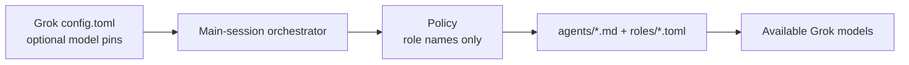

# pilotfish-grok Design Rationale

> This is my Grok Build line of
> [pilotfish](https://github.com/Nanako0129/pilotfish). Same architecture and
> phase-aware lifecycle; install surface and capability primitives are native
> Grok. Packaging lessons from the seven-role host port also show up in
> [pilotfish-codex](https://github.com/miyago9267/pilotfish-codex) (Miyago's
> Codex line). pilotfish-grok has its own release train.

## Purpose

Carry pilotfish's separation of concerns and phase-aware orchestration into
native Grok Build configuration. Role-based policy, approval gates, leaf
workers, and fresh-context verification stay; Claude-specific mechanisms
(`settings.json`, `tools:` allowlists, `Explore` shadowing, Sonnet buckets)
are replaced with Grok surfaces.

## Three-layer translation

| Layer | Grok surface | Owns |
|---|---|---|
| Machine | `~/.grok/config.toml` | Subagent enablement; optional `[subagents.models]` pins; never forces main-session model by default |
| Roles | `~/.grok/agents/*.md` + `~/.grok/roles/*.toml` | Role contract, capability mode, reasoning effort, optional model |
| Policy | `~/.grok/rules/pilotfish-grok.md` | Phase gates, delegation boundaries, approval, integration, verification |

> **Core invariant:** The orchestration **policy names roles but never embeds**
> model IDs or effort levels. Routing changes in agent/role files or
> `[subagents.models]` must not require rewriting the policy.

## Seven Grok roles

| Role | Phase | Capability | Effort | Responsibility |
|---|---|---|---|---|
| `scout` | Discovery | `read-only` | low | Broad or focused recon |
| `plan-verifier` | Plan | `read-only` | medium | `READY` / `REVISE` |
| `security-reviewer` | Plan / Approval | `read-only` | high | Pre-approval security evidence |
| `mech-executor` | Execution | `all` | low | Complete mechanical specs |
| `executor` | Execution | `all` | medium | Local design judgment |
| `verifier` | Verification | `execute` | medium | `CONFIRMED` / `REFUTED` |
| `security-executor` | Execution | `all` | high | Approved security implementation |

Pilotfish's uppercase `Explore` role is deliberately absent. That name exists
to shadow Claude Code's built-in Explore agent so expensive main-session models
do not silently run exploration. Grok already has a separate built-in `explore`
type; `scout` covers pilotfish-grok discovery. Installing a second discovery
agent would duplicate boundaries without the Claude-specific benefit.

### Why verifier uses `execute`, not `read-only`

Claude Pilotfish lets the verifier run Bash while denying Write tools. Grok's
`read-only` capability mode also denies shell. Outcome verification needs tests
and flow reproduction, so the Grok mapping is `execute` (read + shell, no file
edits).

### Capability enforcement order

1. Harness depth limit (subagents cannot spawn subagents)
2. Role `default_capability_mode` on named types
3. Agent prompt contracts (leaf language, no-edit language)
4. Orchestrator discipline: do not override `capability_mode` on named roles

Parent **plan mode does not protect child writes**. Read-only roles must not
rely on the parent remaining in plan mode.

## Effort-first economics

On accounts with a single coding model (for example only `grok-4.5`), multi-model
subscription savings do not apply. pilotfish-grok still pays for itself by:

- Keeping high-volume recon off the main context window
- Bounding mechanical work to low reasoning effort
- Requiring fresh-context verification for non-trivial claims

When cheaper models appear in the catalog, pin them under `[subagents.models]`
without editing policy prose.

## Phase-aware orchestration

Role matching makes work eligible for delegation; it does not make delegation
mandatory. The main session retains framing, Plan synthesis, architecture,
ambiguity resolution, integration, and final judgment.

A single unknown bug should not become a sequential `scout` → `executor`
pipeline when diagnosis, patch design, and live verification share one evidence
chain.

## Deliberately left out

| Not included | Why |
|---|---|
| Eighth `Explore` agent | No Claude-style shadow need; `scout` is enough |
| Forced main-session model | User-controlled; Grok has no `best` alias story |
| Benchmarks / baton gates | v1.0 is installable contracts only |
| Runtime e2e spawn tests | Static contracts first; behavior proof is future work |
| Enforcement hooks | Policy-first, matching Pilotfish philosophy |
| Per-project install | Global `~/.grok/` is the product surface |
| Editing `~/.claude/` | Dual-harness coexistence; Claude pilotfish remains independent |

## Relationship to siblings

| Project | Host | Policy markers | Roles | Maintainer |
|---|---|---|---|---|
| pilotfish | Claude Code | `pilotfish` | 8 (incl. Explore) | me |
| pilotfish-grok | Grok Build | `pilotfish-grok` | 7 | me |
| pilotfish-codex | Codex CLI | `pilotfish-codex` | 7 | Miyago |

I review changes on the Claude Code line and pull them into Grok when they
still make sense here. Source parity with pilotfish is not a goal by itself;
Grok-specific needs win.
